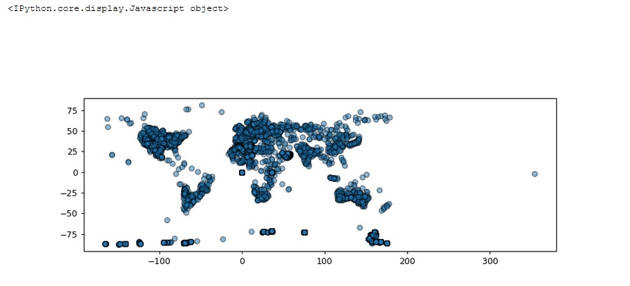

# Interaction, filtering and working with geolocated measures

## Brief Description

This projects aims to manage geolocated data (measurements points or any similar type of usefull information), to filter and interact with it by using simple Python code.

You can follow the "" notebook and be able to play with the information as much as you want.

In this case I decided to try the meteority dataset. So after unzip, load, and some dataframe cleaning; you would see something similar to the following image:

  

