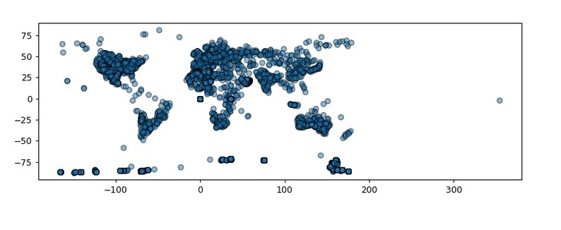
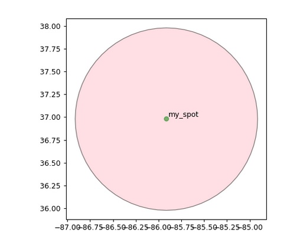
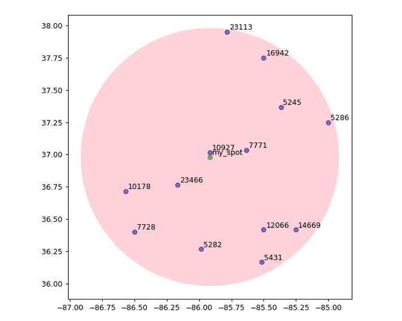
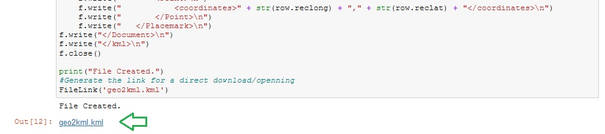
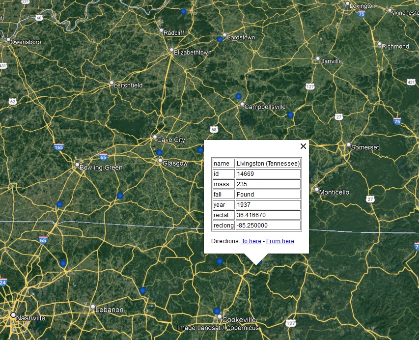

# Interaction, filtering and working with geolocated measures

## Brief Description

This projects aims to manage geolocated data (measurements points or any similar type of usefull information), to filter and interact with it by using simple Python code.

## Installation

(https://towardsdatascience.com/geopandas-installation-the-easy-way-for-windows-31a666b3610f)

Important: The following order of installation using pip install is necessary. Be careful with the filename. It should work if the filename is correct: (Tip: Type “pip install” followed by a space and type the first two letters of the binary and press Tab. (e.g. pip install gd(press Tab))
1. pip install .\GDAL-3.4.2-cp310-cp310-win_amd64.whl
2. pip install .\pyproj-3.3.0-cp310-cp310-win_amd64.whl
3. pip install .\Fiona-1.8.21-cp310-cp310-win_amd64.whl
4. pip install .\Shapely-1.8.1.post1-cp310-cp310-win_amd64.whl
5. pip install .\geopandas-0.10.2-py2.py3-none-any.whl

If while trying to run the Sjoin you get: Spatial indexes require either `rtree` or `pygeos` in geopanda but rtree is installed, then do:
`pip install rtree`.

## Geopandas Application

You can follow the `geopandas_meteorite_landings` notebook and be able to play with the information as much as you want.

In this case I decided to try the meteority dataset. So after unzip, load, and some dataframe cleaning; you would see something similar to the following image:

  

Once you set "your spot" and a radius to take into consideration, the next geoDataFrames will be generated:

  

The next step involves filtering all the meteorites locations based on your selected area. For this the best approach I found was to do an Spatial Join (or sjoin). After you run the respective chunk of code you will see something similar to the following image:

  

After this point you have full control of the data and the area to focus at. You can combine or add more info, make a better way of showing the results or evn storing the geolocated data.

As a last step I considered adding a geopandas to kml code. It's nothing fancy but can help you to have a better way of interacting with the info. Google Earth tends to be very powerfull in managing this kind of information.

Run the code and get a direct download/open link:

  

You should si something like the following:

  

You can play with the points style, size, the table info and much more aspects of the kml.
